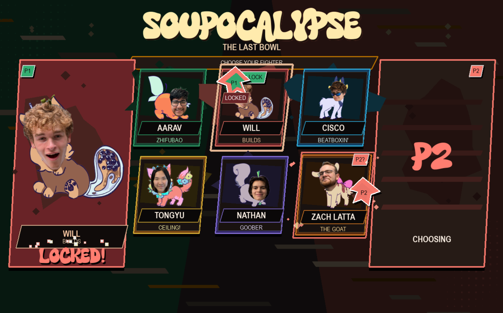
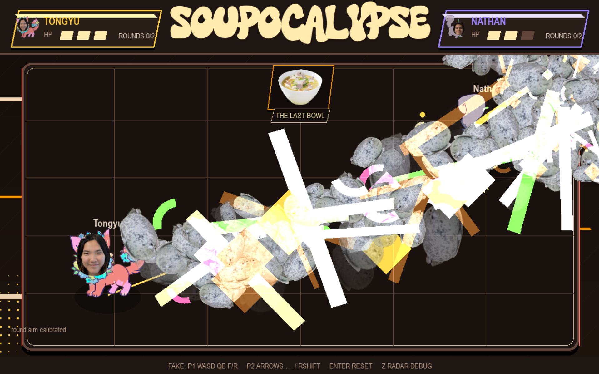
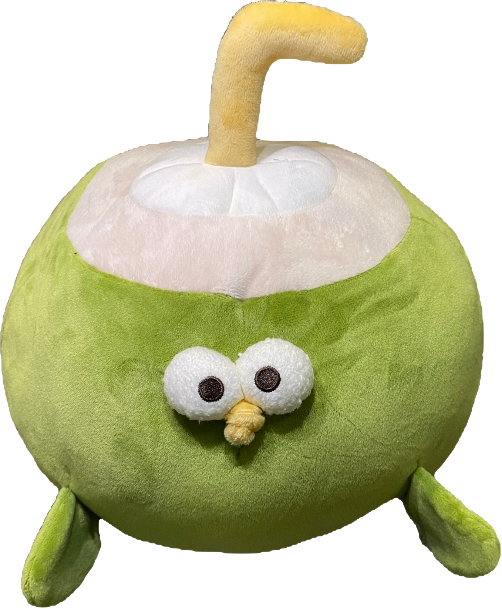
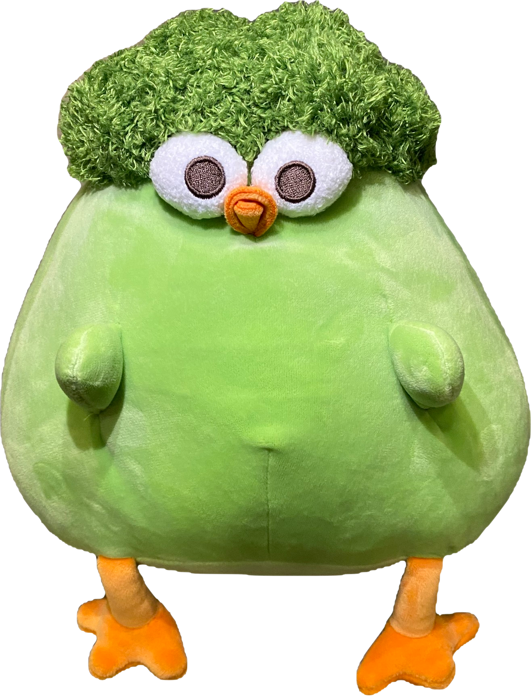

# Soupocalypse: The Last Bowl

Soupocalypse is a hackathon-built physical fighting game where two players become the characters. Players move around a real arena, an mmWave radar tracks their position, handheld controllers send heading and action data, and a laptop turns everything into a chaotic soup-powered battle over the last bowl of authentic Chinese soup.

***Pokémon battles in real life, except you are the Pokémon.***

## Demo Link

[Check out the project demo on YouTube!](https://youtu.be/BXd05WfaruQ)

## Pictures







## What It Does

Two players stand inside a taped arena and fight as custom Soupocalypse characters. The arena is tracked with an **HLK-LD2450 mmWave Human Radar**, while each player controller provides heading, action input, and wireless game data.

The laptop runs the main Soupocalypse game engine. It receives live radar/player packets, tracks each player inside the arena, handles combat rules, renders the spectator display, plays music/SFX, and runs the full tournament-style match flow.

Players can attack with a forward/down swing to fire a beam or use an up action to create a shield bubble. Hits remove HP, shields block attacks, knockouts end rounds, and the full match system tracks wins until one player claims the soup.

The game features **6 organizer characters**, each with unique colors, portraits, attack styles, custom animations, impact effects, voice lines, and victory presentation.

## Features

* **mmWave Human Radar**: Tracks player movement in the real-world arena using the HLK-LD2450.
* **Full Tournament System**: Best-of-3 round flow with character select, countdowns, round wins, match wins, and reset handling.
* **6 Organizer Characters**: Playable custom characters based on organizers, each with their own portrait, theme, tagline, and attack style.
* **Custom Animations**: Character select animations, attack effects, hit effects, shields, particles, screen shake, impact frames, KO effects, and victory screens.
* **Soup Combat**: Beam attacks, bubble shields, HP, cooldowns, hit freeze, and crunchy SFX.
* **Dynamic Music System**: Lobby music, battle music, low-health/intense tracks, near-win music, and victory music.

## System Overview

* **Player 1/2 Controllers**: Sends heading and action data for both players.
* **HLK-LD2450 Radar**: Tracks blobs inside the arena and provides player position data.
* **Bridge Node**: Connects the hardware system to the laptop over serial.
* **Laptop Server**: Python/Pygame game engine, combat system, music/SFX manager, tournament controller, and spectator display.

## Characters

* **Aarav** - Zhifubao
* **Will** - Builds
* **Cisco** - Beatboxin'
* **Tongyu** - Ceiling!
* **Nathan** - Goober
* **Zach Latta** - The Goat

Each character has:

* A portrait
* A theme color palette
* A custom tagline
* A unique attack type
* Custom fight effects
* Select, attack, hit, and victory audio support

## Firmware Map

* [`code/player/player.ino`](code/player/player.ino): Firmware for the player controllers. It reads motion/heading input, detects beam/shield actions, tracks player state, and sends player packets to the server.
* [`code/bridge/bridge.ino`](code/bridge/bridge.ino): Firmware for the bridge. It receives player and radar data, sends packets to the laptop over serial, and can trigger physical FX outputs.
* [`firmware_d15ac61/`](firmware_d15ac61/): Additional firmware/exported hardware files from the hackathon build.

## Server And Assets

* [`code/server/soupocalypse.py`](code/server/soupocalypse.py): Main Python/Pygame game. It handles rendering, player tracking, combat, tournament flow, music, sound effects, fake controls, and serial input.
* [`code/server/requirements.txt`](code/server/requirements.txt): Python dependencies.
* [`code/server/assets/fonts/`](code/server/assets/fonts/): Fonts used by the spectator display.
* [`code/server/assets/sprites/`](code/server/assets/sprites/): Character portraits and game sprites.
* [`code/server/assets/music/`](code/server/assets/music/): Lobby, battle, intense battle, near-win, and victory music.
* [`code/server/assets/generated_audio/fight/`](code/server/assets/generated_audio/fight/): Fight UI sounds, impacts, round sounds, and character voice lines.

## Run The Game

Install dependencies on a Python install with Pygame support:

```powershell
python -m pip install -r code/server/requirements.txt
```

Run without hardware:

```powershell
python code/server/soupocalypse.py --fake
```

The game opens native fullscreen by default. Use `--windowed` while tuning for your potential setup:

```powershell
python code/server/soupocalypse.py --fake --windowed
```

## Fake Controls (super useful for testing)

```text
P1 move: WASD
P1 aim: Q/E
P1 beam: F
P1 bubble: R

P2 move: arrow keys
P2 aim: comma / period
P2 beam: slash
P2 bubble: right shift

Enter: reset/start match
Esc: quit
```

## Game Rules

* Players select one of the 6 Soupocalypse characters.
* The match is best of 3 rounds.
* Each player starts with 3 HP.
* A beam hit removes HP.
* A bubble shield blocks attacks while active.
* The winner gets the soup.

## Arena

We taped the playable radar area conservatively (the radar can see a bit beyond the tape). The arena is roughly 4m wide and 3.7m deep.

```text
x = -2.0m to +2.0m
y = 0.8m to 4.5m
```
